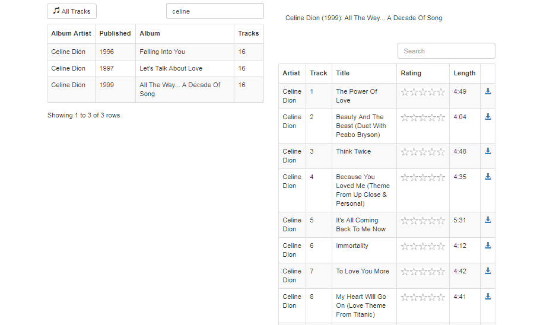

This is a package to provide a search and download section for a local music directory. It relies on my small service which
retrieves the list of titles and albums https://github.com/areisenb/musicDir. For the download the upnp server mediatomb (mediatomb.cc)
is required. All those assets need to be made available via a http reverse proxy.


# Topology
## backend
runs in a docker container on a raspi as a nodejs application to
* being pushed with album and title information as json file

````
data/music.album.json
[
  { "id":1,"artist":"ABBA","year":1992,"album":"Gold - Greatest Hits",
    "cover":"/home/family/media/musicDirPDF.d/media.tex.d/000020.jpeg",
    "tracks":19 },
  { "id":2,"artist":"Adele","year":2011,"album":"21",
    "cover":"/home/family/media/musicDirPDF.d/media.tex.d/000031.jpeg",
    "tracks":11 },
  ...
]

data/music.title.json
[
  { "id":16417,"artist":"ABBA","year":1992,
    "album":"Gold - Greatest Hits","albumId":1,"track":1,
    "title":"Dancing Queen","len":231 },
  { "id":16435,"artist":"ABBA","year":1992,
    "album":"Gold - Greatest Hits","albumId":1,"track":2,
    "title":"Knowing me, knowing you","len":242 },
  { "id":16381,"artist":"ABBA","year":1992,
    "album":"Gold - Greatest Hits","albumId":1,"track":3,
    "title":"Take a chance on me","len":244 },
  ...
]
````

* provide the list of titles and albums via REST API
* serves static web pages
## frontend
is a simple bootstrap/jQuery web page (not looking too nice) which is served by the nodejs backend
as described above.
The frontend should be embedded with a series of other pages as an iframe in something like a container
which serves the header and navigation menu. It not only allows to search for albums and titles but
also allows to download certain titles as mp3 file

# Example GUI
this is how it looks at home for me


# Config
pls check /config-template for the easiest config file in yaml format. I do not want to expose my working example here, but 
am optimistic enough to guess everybody who wants to easily can adapt for his needs. Once your config file is composed make it available
below /config in production environment

# Deployment as docker container
* serves port 8106
* expects data/music.album.json and data/music.title.json as volume mount
* expects a path to download music titles (the only relevant portion is the id parameter); 
in my case this is provided via nginx reverse proxy
````
http://<host>/music/<artist> - <leading zero 2 digit track#> - <title>.mp3?id=<titleId> 
````
